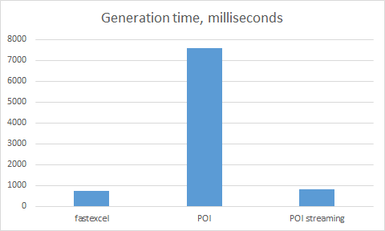
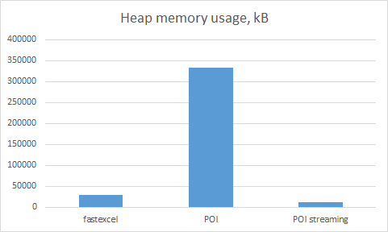
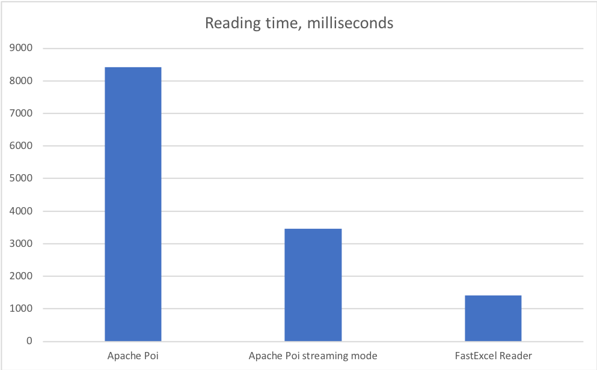

fastexcel
=========
[](https://github.com/dhatim/fastexcel/actions)
[](https://coveralls.io/github/dhatim/fastexcel?branch=master)
[](https://maven-badges.herokuapp.com/maven-central/org.dhatim/fastexcel)
[](http://www.javadoc.io/doc/org.dhatim/fastexcel)

# fastexcel-writer

There are not many alternatives when you have to generate xlsx Excel workbooks in Java. The most popular one ([Apache POI](https://poi.apache.org/)) includes many features, but when it comes down to huge worksheets it quickly becomes a memory hog.

Its streaming API may mitigate this problem but it introduces several limitations:
- Its sliding window mechanism prevents you from accessing cells above the current writing position.
- It writes stuff to a temporary file.
- It comes with an overhead on the file size because shared strings are disabled by default. Enabling shared strings is likely to consume much more heap if you deal with string values.

So, fastexcel has been created to offer an alternative with the following key points:
- Limited set of features (basic style support, no graph support yet) and very simple API.
- Reduced memory footprint and high performance by accumulating only necessary elements. XML stuff is piped to the output stream at the end.
- Multithreading support: each worksheet in the workbook can be generated by a different thread, while fully supporting shared strings and styles.

## Benchmark

In this simple benchmark test, we generate a workbook with a single worksheet containing 100,000 rows and 4 columns.
Apache POI (non-streaming) is about 10 times slower than fastexcel and uses 12 times more heap memory.
The streaming API of Apache POI is almost on par with fastexcel in terms of performance and uses less heap just because it keeps only 100 rows in memory: see related limitations in the paragraph above.





Note heap memory usage is measured just before flushing the workbook to the output stream.


## Prerequisites

- Java 8+. Build with Maven.
- Include the following dependency in your POM:
```xml
<dependency>
    <groupId>org.dhatim</groupId>
    <artifactId>fastexcel</artifactId>
    <version>0.12.13</version>
</dependency>
```

## Examples

The javadoc for the last release is available [here](http://www.javadoc.io/doc/org.dhatim/fastexcel).

### Simple workbook

Create a workbook with a single worksheet and a few cells with the different supported data types.

```java
try (OutputStream os = ...) {
    Workbook wb = new Workbook(os, "MyApplication", "1.0");
    Worksheet ws = wb.newWorksheet("Sheet 1");
    ws.value(0, 0, "This is a string in A1");
    ws.value(0, 1, new Date());
    ws.value(0, 2, 1234);
    ws.value(0, 3, 123456L);
    ws.value(0, 4, 1.234);
    wb.finish();
}
```

### Styles and formatting

Change cell style to bold with a predefined fill pattern:
```java
ws.style(0, 0).bold().fill(Fill.GRAY125).set();
```
Apply formatting to a cell containing a timestamp:
```java
ws.value(0, 0, LocalDateTime.now());
ws.style(0, 0).format("yyyy-MM-dd H:mm:ss").set();
```

### Cell ranges

Set style on a range of cells:
```java
ws.range(0, 0, 10, 10).style().horizontalAlignment("center").italic().set();
```
Merge cells:
```java
ws.range(0, 0, 10, 10).merge();
```
Shade alternate rows:
```java
ws.range(0, 0, 10, 10).style().shadeAlternateRows(Color.GRAY2).set();
```
or shade every Nth row (e.g. every 5th):
```java
ws.range(0, 0, 10, 10).style().shadeRows(Color.GRAY2, 5).set();
```
Name a cell range (name of a cell range can only include letters, numbers and underscore):
```java
ws.range(0, 0, 0, 10).setName("header");
```

### Formulas

Note the cells with a formula do not have a value in the generated workbook.
```java
ws.formula(10, 0, "SUM(A1:A10)");
// With Range.toString():
ws.formula(10, 0, "SUM(" + ws.range(0, 0, 9, 0).toString() + ")");
```

### Additional worksheet features

To keep the sheet in active tab:
```java
ws.keepInActiveTab();
```
Set page orientation (visible in print preview mode):
```java
ws.pageOrientation("landscape");
```
Set bottom, top, left, or right margin:
```java
ws.leftMargin(0.3);
ws.bottomMargin(0.2);
```
Create a freeze pane (some rows and columns will be kept still while scrolling).\
To freeze the first column on the left and the top three rows:
```java
ws.freezePane(1, 3);
```
Define repeating rows or columns for the print setup.
```java
ws.repeatRows(0, 4); // keep first top 5 rows on each page when printing.
ws.repeatRows(2); // keep the third row on each page when printing.

ws.repeatCols(0, 2); // repeat first three columns (A to C) on each page when printing.
ws.repeatCols(0); // repeat only first column (A) on each page for the print setup.
```
Set header and footer content.\
To set page enumeration in the top right:
```java
ws.header("page 1 of ?", Position.RIGHT);
```
To set custom text in the footer (bottom left):
```java
ws.footer("Generated with Fastexcel", Position.LEFT, "Arial", 10);
```
To provide sheetname in the bottom central position:
```java
ws.footer("sheetname", Position.CENTER, 8);
```
To set firstPageNumber to 2 (default is 0):
```java
ws.firstPageNumber(2);
```
To remove any cell background color or font color for the print setup:
(this does not apply to printer color settings, only removes any colored rows etc. - see in print preview)
```java
ws.printInBlackAndWhite();
```
To revert back the colors for the print setup:
```java
ws.printInColor();
```
To set the scaling factor to 60 % for the print setup:
```java
ws.pageScale(60);
```
To enable autoPageBreaks:
```java
ws.setAutoPageBreaks(true);
```
To set fitToPage:
```java
ws.setFitToPage(true);
```
To set fitToWidth to 2 pages with unlimited number of rows:
```java
ws.setFitToPage(true);
ws.fitToWidth(2);
ws.fitToHeight(999);
```

### Multithreaded generation

Each worksheet is generated by a different thread.
```java
try (OutputStream os = ...) {
    Workbook wb = new Workbook(os, "MyApplication", "1.0");
    Worksheet ws1 = wb.newWorksheet("Sheet 1");
    Worksheet ws2 = wb.newWorksheet("Sheet 2");
    CompletableFuture<Void> cf1 = CompletableFuture.runAsync(() -> {
        // Fill worksheet 1
        ...
    });
    CompletableFuture<Void> cf2 = CompletableFuture.runAsync(() -> {
        // Fill worksheet 2
        ...
    });
    CompletableFuture.allOf(cf1, cf2).get();
    wb.finish();
}
```

# fastexcel-reader

The reader part of fastexcel is a streaming alternative of [Apache POI](https://poi.apache.org/). It only reads cell content. It discards styles, graphs, and many other stuff. The API is simplier than streaming API of Apache POI.

## Benchmarks

In this simple benchmark test, we read a workbook of 65536 lines. We see that Apache Poi (non-streaming) is about 10x times slower than fastexcel read. The streaming API of Apache POI is about 2x times slower.
In between there a more developer friendly wrapper around Apache Poi called [Excel Streaming Reader (xlsx-streamer)](https://github.com/monitorjbl/excel-streaming-reader).



## Prerequisites

- Java 8+. Build with Maven.
- Include the following dependency in your POM:
```xml
<dependency>
    <groupId>org.dhatim</groupId>
    <artifactId>fastexcel-reader</artifactId>
    <version>0.12.3</version>
</dependency>
```

## Examples

### Simple reading

Open a workbook and read all rows in a streaming way.

```java

try (InputStream is = ...; ReadableWorkbook wb = new ReadableWorkbook(is)) {
    Sheet sheet = wb.getFirstSheet();
    try (Stream<Row> rows = sheet.openStream()) {
        rows.forEach(r -> {
            BigDecimal num = r.getCellAsNumber(0).orElse(null);
            String str = r.getCellAsString(1).orElse(null);
            LocalDateTime date = r.getCellAsDate(2).orElse(null);
        });
    }
}

```

You can read all rows to a list with:

```java
List<Row> rows = sheet.read();
```

Iterate on row to get all cells.

```java
Row row = ...;
row.forEach(cell -> {
    ...
});
```
